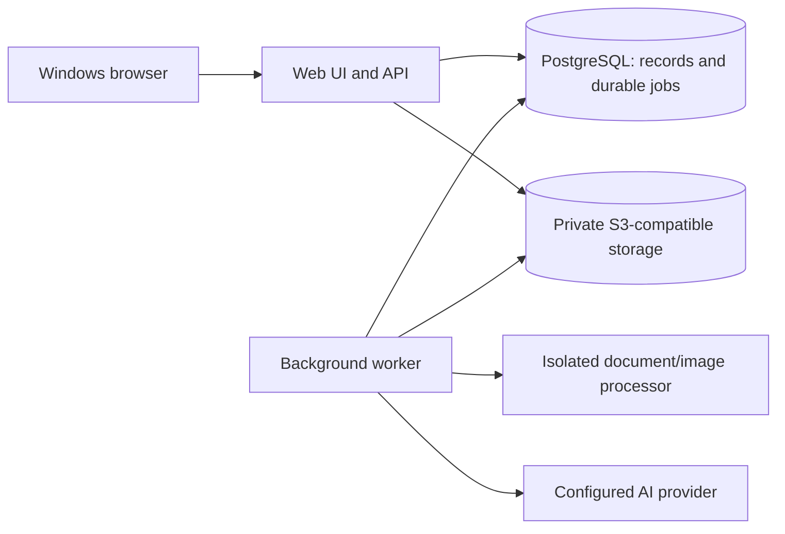

# Packaging Proof — Product, Architecture, and Implementation Specification

### Active repair — 2026-10-02: Linux processor memory failure

The supplied 2,986,385-byte, one-page CDS Rev.00 PDF succeeded locally in 1.77–5.06 seconds but failed in Railway. A read-only production diagnostic on the existing failed upload confirmed default native imports create 63 threads and reserve 5,891,352 KiB virtual memory before the renderer applies its 1.5 GiB limit; the processor exits 1 with empty stderr. With native thread pools capped to one, virtual memory is 303,996 KiB and the same PDF succeeds in 841 ms. No artwork or credentials were logged or committed; temporary diagnostic files were removed.

Fix: force BLAS/OpenMP thread counts before native imports, limit OpenCV to one thread, retain existing resource limits, report MemoryError explicitly, and distinguish timeout/signal/exit failures in the worker. Added a synthetic subprocess regression with inherited 64-thread settings. Seven local processor tests, TypeScript checks and worker lint pass. Linux regression, deployment and retry verification pending; temporary Railway diagnostic configuration must be removed after validation.

Version: 1.0

Created: 2026-10-01

Status: Initial project configuration validated; product implementation pending
Owner: Product owner and implementing coding agent

## 1. Purpose and authority

Build a self-hosted web application for packaging artwork review, with source code stored in Git and deployment on Railway. Designers upload successive revisions; marketing and QA/legal reviewers annotate artwork, verify corrections, compare changes, and approve an exact revision.

This document is the implementation reference and living task tracker. User instructions supersede this document. Sections labelled **default** are proposed engineering decisions, not previously confirmed user choices. Agents may refine these decisions with evidence and must record material changes in the decision log.

The original request delivered documentation only. The current request initializes a local child Git repository and project configuration. Neither the specification nor the scaffold represents a completed application, Git publication, or Railway deployment.

### Confirmed user requirements

1. A project tracks revisions for one packaging artwork item, with designer uploads.
2. A high-fidelity viewer supports detailed zoom, two-version comparison, and optional synchronized zoom/scroll.
3. Reviewers draw rectangular annotations and comment directly on artwork; designers track and resolve issues individually.
4. An AI-assisted analyser identifies and highlights changed artwork while ignoring review annotations.
5. The application is self-hosted, maintained in Git, and deployable to Railway with required resources.
6. Coding agents continuously maintain implementation status, decisions, tests, and handoff notes here.

### Product outcome

On opening a new revision, a reviewer can immediately identify requested fixes ready for verification, unresolved issues, unexpected artwork changes, and pending approval decisions.

## 2. Scope and release boundaries

### First release

- Authenticated, invite-only internal workspace with project-level access.
- Projects, immutable revisions, original-file downloads, and activity history.
- PDF-first artwork viewing; PNG/JPEG support.
- Single and synchronized side-by-side views, overlay comparison, measurement, page navigation.
- Rectangle/pin annotations, threaded comments, assignment, issue status and verification.
- Deterministic visual/text comparison plus AI descriptions and proposed issue matching.
- Separate marketing and QA/legal approval decisions for an exact revision.
- In-app activity/notifications, job progress, retries, and actionable error states.
- Railway deployment, private storage, database migrations, backups, and operational documentation.

### Later releases

- QA-owned regulatory rule library and approved-copy validation.
- Dependency-aware revalidation of previously passed QA checks.
- Barcode validation, advanced print/prepress checks, spot-colour and overprint inspection.
- Native Illustrator editing/import beyond compatible PDF exports.
- Project families, bulk SKU variants, external guest links, SSO, email notifications.
- Certified electronic signatures or regulated-system validation.

Do not represent the first release as an automated compliance certification system. A changed or unchanged region is evidence for review, not a regulatory pass.

## 3. Domain and permissions

Default: one organization per deployment, with organization IDs on domain records to enforce clear boundaries. One project represents one SKU/pack size/market/language combination. A revision contains one PDF or image; multipage PDFs are supported. Multiple packaging components are separate projects initially.

| Role | Permissions |
| --- | --- |
| Administrator | Manage users, membership, settings, review policy, and archive projects; no implicit reviewer signature |
| Designer | Create assigned projects, upload revisions, respond to issues, mark fixes ready for verification |
| Reviewer | Annotate, create issues, verify/reopen fixes, and submit decisions for assigned review scopes |
| Viewer | Read authorized artwork, issues, and decisions; no mutations |

A member can hold designer and reviewer capabilities, but cannot verify their own correction by default. Review scope is marketing or QA/legal and is distinct from access role. Validate access server-side for every operation, including file URLs, exports, polling, and background-job requests.

## 4. User interface and workflows

### 4.1 Project dashboard and creation

Dashboard displays thumbnail, project name, SKU, market, latest revision, review status, unresolved issue count, assigned reviewers, and last activity. Include search, status/assignee filters, pagination, empty state, and archived-project filter.

Create-project form: name (required), SKU, product, pack size, market, language, designer, required marketing reviewer(s), required QA/legal reviewer(s), and first file. Metadata may be incomplete in draft; require review assignments before submission.

Project overview contains the latest revision, revision timeline, outstanding issues, decisions, and activity. Uploading a new revision requires a file and permits notes describing intended changes. Revision numbers are generated transactionally, never derived from filenames.

Project lifecycle: `draft -> in_review -> changes_requested -> in_review -> approved`; `archived` is an independent archival flag. New uploads return the project to draft until submitted. Preserve historical approved revisions, but label them as superseded when a new revision exists.

Acceptance: two simultaneous uploads produce distinct sequence numbers; failed processing does not erase originals or earlier revisions; the UI never implies that an older approval applies to a new upload.

### 4.2 Proofing workspace

```text
+--------------------------------------------------------------------------+
| Project / SKU | Left revision | Right revision | Compare | Review decision |
+------------+------------------------------------------+------------------+
| Pages      |                                          | Issues           |
| Revisions  |        Single artwork or two panes        | Changes          |
|            |                                          | Review           |
|            |                                          | Activity         |
+------------+------------------------------------------+------------------+
| Pan | Select | Rectangle | Pin | Measure | Zoom | Sync | Overlay toggles    |
+--------------------------------------------------------------------------+
```

- Artwork dominates the screen; both sidebars collapse.
- Default opens the latest viewable revision. Comparing defaults to its predecessor, with arbitrary earlier revisions selectable.
- Fit-page, fit-width, zoom control, pan, fullscreen, page thumbnails, keyboard shortcuts.
- Independent toggles for synchronized zoom, normalized pan/scroll, and mapped-page navigation.
- Side-by-side and opacity-overlay modes. Label both revision identities persistently.
- Annotation/change overlays can be toggled independently without changing the source rendering.
- Clicking an issue/change scrolls to its page and frames the relevant region.
- Preserve filters and viewer position when opening/closing issue details.
- Show processing, failed, unsupported, and unavailable-page states distinctly.
- Never silently substitute a low-resolution thumbnail for the detailed proof.

Target desktop browsers: current Chrome and Edge on Windows; Firefox is secondary. Desktop minimum layout target is 1366x768. Smaller screens support reading issues and single-pane review; advanced comparison may require desktop width. Keyboard focus, accessible labels, non-colour-only statuses, and adequate contrast are required.

### 4.3 Annotation and issue workflow

Rectangle drag or pin click opens an issue composer. Fields: title, description, category (marketing, wording, legal/QA, layout, graphics, other), severity (blocking/nonblocking), assignee, and optional due date. A rectangle/pin is an anchor, not a modification to the source file.

Lifecycle: `open -> in_progress -> ready_for_verification -> closed`. Reopening returns to `open` with a reason. Marking ready requires a candidate fix revision and optional designer note. Closing requires an authorized reviewer, the verified revision, and a recorded decision. Nonblocking issues can remain open at approval, with explicit acknowledgement.

- Stable issue IDs survive all revisions.
- Keep original revision/page/geometry permanently.
- Maintain separate anchors for later revisions, with `original`, `proposed`, `confirmed`, or `unmapped` state.
- Automated relocation is a suggestion. Low-confidence mapping must be shown as unmapped, never silently accepted.
- For verification, show request, original region, candidate fix region, discussion, and history together.
- A closed issue remains historically closed; later relevant changes produce a recheck suggestion, not an automatic claim of continued correctness.
- Threaded replies and in-app mentions; edits retain history and author/time.
- Filters: status, scope, severity, assignee, source revision, and verification revision.

Acceptance: a rectangle stays aligned after zoom, pan, rotation, resizing, and reload; reviewer can reject a claimed fix; annotations never appear in clean source comparison; uncertain anchors are obvious.

### 4.4 Change analysis

Each analysis is tied to an ordered revision pair and immutable configuration snapshot. The UI presents region overlays plus cards with before/after crops, change type, deterministic evidence, AI description, and optional suggested linked issue.

Types: text edited/added/deleted, graphic changed, moved, resized, page added/removed, geometry changed, and uncertain. Do not claim movement or resizing with high certainty when only a pixel difference is known.

Reviewer dispositions: `unreviewed`, `expected`, `needs_attention`, `comparison_noise`. A needs-attention finding can create/link an issue. Record who applied each disposition and why. AI must never close issues, approve artwork, or hide unreviewed deterministic findings.

Show job stages, coverage, exclusions, failures, and retry. A partial result must not read as “no changes.” Manual reviewing remains available during AI outages.

### 4.5 Review and approval

Submission creates a review round snapshot containing revision ID/hash and required reviewer assignments. Default policy: every assigned required reviewer must approve. Changing assignments after submission requires a new round; earlier decisions remain historical.

- Reviewer decisions: approve or request changes, with optional note; changes requested requires a reason.
- Any required request-changes decision prevents final approval.
- Final approval requires all required approvals and no blocking issues.
- Default also requires all generated change findings to be dispositioned. If analysis fails/is unavailable, authorized QA must explicitly record manual comparison completion and reason instead; this does not waive open blocking issues.
- Finalization is transactional and checks current revision, round, issues, and decisions to prevent stale-tab approval.
- Approved rounds are read-only; reopening review creates a new round and records why.
- Original approved file download is tied to the recorded file checksum.

Acceptance: uploading V4 during a V3 review cannot accidentally approve V4; a designer cannot verify their own fix; a stale approval request fails with a clear conflict message.

## 5. Technical architecture

### 5.1 Proposed default stack

These choices are starting defaults. Pin compatible stable versions and commit lockfiles during implementation; no version compatibility has been validated by this specification.

| Layer | Default | Rationale |
| --- | --- | --- |
| Web UI and API | TypeScript, React, Next.js | Single application for authenticated screens and server-side domain operations |
| UI components | Accessible component primitives and Tailwind CSS | Consistent reusable controls; artwork-first layout |
| Browser PDF viewer | PDF.js with custom SVG annotation overlay | Browser PDF rendering plus separate coordinate-aware markup |
| Database | PostgreSQL with Prisma migrations | Relational history, transactions, permissions, and structured metadata |
| Background orchestration | Node.js worker with PostgreSQL-backed durable queue, candidate pg-boss | Separate heavy work without introducing Redis initially |
| Document/image processing | Isolated Python subprocess, PDFium-based rendering, OpenCV/Pillow | Bounded rendering and image alignment/diff pipeline |
| Storage | Private S3-compatible bucket | Durable originals and generated assets independent of container disk |
| Authentication | Maintained server-side session/authentication library | Avoid custom cryptography; invite-only accounts |
| AI | Server-side multimodal provider adapter | Configurable model/provider, replaceable without domain changes |
| Verification | Unit/integration tests plus Playwright critical user journeys | Geometry, access, lifecycle, and visual correctness |

Select and document the auth library and processing dependencies after checking maintenance, licenses, and rendering quality. Validate Thai/English rendering and extraction if present in supplied artwork; language coverage must be measured, not assumed. AI provider/model remains unselected.

### 5.2 Service topology



Default Railway resources: one web service, one worker service, PostgreSQL, and a private storage bucket. Separate staging and production data/credentials. Only web has a public application endpoint. Prefer private networking for the database. Worker temporary files are disposable and must be cleaned after jobs; no originals depend on service filesystem persistence.

Self-hosted means the application and records run in the owner's environment. A cloud AI provider still receives selected artwork crops/text when enabled. Clearly document that boundary and allow AI to be disabled; do not assume a self-hosted model is included.

### 5.3 Suggested repository structure

```text
apps/web/                 UI, authenticated API, domain entry points
apps/worker/              Queue consumers and processing orchestration
packages/domain/         Shared schemas, permissions, state transitions
packages/db/             ORM schema, migrations, data access
packages/viewer/          Coordinates, rendering adapters, comparison controls
services/processor/      Python rendering/alignment/difference modules
tests/                   Synthetic fixtures, integration and end-to-end tests
infra/                   Docker and Railway deployment configuration
docs/                    Runbooks and expanded architecture decisions
PACKAGING_PROOF_SPEC.md   This specification and live tracker
```

Use a monorepo with one JS package manager and committed lockfile; pin Python dependencies separately. Add a brief root AGENTS.md during scaffolding that points agents here. Do not split services further without a concrete need.

## 6. Data model and invariants

All domain IDs are opaque UUIDs; timestamps are UTC, displayed in the user's timezone (initial default Asia/Bangkok). Tables include organization/project ownership where appropriate, creator IDs, and optimistic-concurrency versions for mutable records.

| Entity | Key fields / relationships |
| --- | --- |
| Organization, User, Membership | Identity, capabilities, account state, sessions/invitations through auth library |
| Project, ProjectMember | SKU/market/language metadata, owner, members, archival flag, current revision pointer |
| FileAsset | Object key, SHA-256, MIME, byte size, upload/validation state, original filename |
| Revision | Project, unique sequence, source asset, notes, processing state, uploader |
| RevisionPage | Revision, page index, page boxes, rotation, units/physical dimensions, render metadata |
| Issue | Project, stable display number, status, severity, category, assignee, original revision |
| IssueAnchor | Issue, revision/page, normalized geometry, mapping state, source anchor, confidence/evidence |
| IssueComment, IssueEvent | Discussion and append-only lifecycle history; fix/verification revision references |
| ComparisonRun | Revision pair, input hashes, algorithm/model versions, config/exclusions, state and coverage |
| ChangeFinding | Run, before/after page/geometry, type, scores, evidence asset references, AI output |
| FindingReview | Finding, disposition, reviewer, reason, timestamp, linked issue |
| ReviewRound, ReviewAssignment | Revision/hash, policy snapshot, required reviewer/scope, round state |
| ReviewDecision | Assignment, decision, actor/time, reason; supersession retained |
| AuditEvent | Actor, action, target, safe before/after metadata, request ID, timestamp |
| Notification | Recipient, event, read time, authorized target reference |

Invariants:

- Unique `(project_id, revision_sequence)` and `(project_id, issue_number)`.
- References across issues, anchors, files, comparisons, and decisions must stay in the same authorized project.
- Uploaded originals are immutable; replacement always produces a new revision/object.
- Repeated processing is idempotent; cache keys include input hashes and processing configuration.
- Original anchors and old comparison results are not overwritten by later mappings/runs.
- Audit records are append-only through the application; do not describe them as tamper-proof against database administrators.
- Archive is the default removal operation. Permanent data deletion and retention policy are future explicit administrative operations.

## 7. Upload, rendering, and coordinate design

### Upload pipeline

1. Authorize project upload; allocate an expiring upload intent and private object key.
2. Transfer through a signed upload URL if supported, otherwise a bounded authenticated streaming endpoint.
3. Finalize server-side: verify ownership, size, file signature, checksum, and existence. Never trust the filename or client MIME alone.
4. Allocate the immutable revision and enqueue processing transactionally. Clean abandoned upload objects using a documented grace period.
5. Worker extracts page metadata and text, builds thumbnails/previews, and records errors/coverage.
6. When ready, enqueue comparison with the prior suitable revision; the user can choose a different pair.

Default configurable limits: 100 MB/file and 50 PDF pages. Reject encrypted/password-protected PDFs with an actionable instruction to upload an unlocked export. Enforce limits on expanded pixel count, renderer memory, wall time, and subprocess lifetime as well as input bytes.

### Rendering and coordinates

- Retain original PDF bytes. Use PDF.js for interactive rendering, progressively increasing resolution within a canvas memory budget. Evaluate tiling for large pages/high zoom during the viewer spike.
- Store rectangles as normalized `(x, y, width, height)` and pins as `(x, y)` relative to a defined unrotated visible page box, origin top-left. Store page box/rotation metadata and explicit transforms to PDF coordinates, raster pixels, and screen coordinates.
- Page rotation, crop offsets, device pixel ratio, zoom, and pan must be covered by coordinate tests.
- Map synchronized views through normalized viewport centre and relative scale, not identical raw scroll offsets. Guard against reciprocal scroll event loops.
- Do not assume page N still corresponds to page N after insertions/removals. Store page mappings and offer manual correction.
- Measurement uses PDF page units and verified output scale; respect PDF UserUnit. Images need explicit physical dimensions/DPI confirmation. Show unknown scale rather than invented millimetres.
- Screen rendering is not a certified colour proof; 100% zoom does not establish physical print size.

## 8. Analysis pipeline and AI contract

### Deterministic stages

1. Match pages using dimensions/content signatures; flag ambiguous or missing matches.
2. Render both pages with the same engine, colour settings, and resolution. Record those settings.
3. Align only justified global translation/rotation/scale, and expose the transform. Preserve/report geometry changes so alignment does not erase meaningful resizing or movement.
4. Generate visual difference masks, suppress known raster noise using versioned thresholds, and group nearby components into candidate regions.
5. Extract native text with position information; compare additions/deletions/substitutions. OCR fallback is optional and explicitly labelled with coverage/uncertainty; outlined text cannot be treated as reliable native text.
6. Produce before/after crops with surrounding context, plus raw difference evidence. Keep deterministic findings available even if AI fails.

### AI stages

Pass bounded before/after crops, candidate region IDs, extracted text when available, and relevant issue descriptions to a configurable multimodal provider. Require schema-validated JSON: region ID, proposed type, concise description, uncertainty, suggested issue IDs, and rationale. Validate IDs and bounds server-side. AI receives no authority to mutate issue/approval status.

Treat artwork text and comments as untrusted content, not instructions. Do not let model output execute code, fetch arbitrary URLs, or trigger external actions. Record provider/model, prompt version, input references, elapsed time, and usage/cost where available; avoid logging confidential crop contents.

### Annotation exclusion

- Application overlays are separate database records and never enter clean renders.
- Detect native PDF annotations where possible. Offer a documented comparison-render mode that omits review annotation objects while retaining originals; record what was excluded. Distinguish annotations from artwork/form content and verify renderer behaviour with fixtures.
- Flattened annotations are indistinguishable from artwork in some files. Provide reviewer-defined exclusion regions or request a clean export. Never claim universal automatic removal.
- Exclusions are versioned per comparison, visible as hatched regions, and reduce reported coverage. Changes inside exclusions are not verified.
- Different page size, poor alignment, text extraction failure, or incomplete processing produces uncertainty/partial coverage, not a pass.

### Job reliability

Durable jobs have queued/running/succeeded/partial/failed/cancelled states, heartbeat/lease, progress, bounded retries with backoff, and error codes. Worker restart recovers abandoned work. Unique run keys prevent duplicate results. Reprocessing creates a new run when configuration changes; old reviewer dispositions remain attached to the old run and are not silently transferred.

## 9. API contract outline

Prefer authenticated same-origin REST endpoints with shared validation schemas. Exact route names may change if documented.

| Endpoint group | Operations |
| --- | --- |
| `/api/projects` | List/create; read/update/archive project; manage authorized members |
| `/api/projects/:id/uploads` | Create intent; finalize upload; retrieve processing state |
| `/api/projects/:id/revisions` | List revisions, retrieve page metadata, authorize original/preview access |
| `/api/projects/:id/issues` | Create/list issues; comments; anchors; assignment; explicit transition commands |
| `/api/projects/:id/comparisons` | Start/list runs; progress; findings; exclusions; retry/cancel |
| `/api/findings/:id/reviews` | Record disposition or create/link issue |
| `/api/revisions/:id/review-rounds` | Submit round; retrieve assignments; submit decisions; finalize/reopen |
| `/api/notifications` | List/mark read |
| `/health/live`, `/health/ready` | Process liveness and bounded readiness checks |

Use pagination, structured errors, request IDs, idempotency keys for upload finalization/job creation, and expected record versions for conflicting edits. A 409 conflict should explain that state changed and offer reload. Long work returns a job ID promptly; do not keep an HTTP request open through rendering or AI. Poll progress initially; add server-sent events only if justified.

## 10. Security, storage, and operational requirements

- Invite-only accounts, secure HTTP-only session cookies, CSRF protection as appropriate, rate limits, and server-side authorization. No default production credentials.
- Private objects accessed through short-lived authorized URLs or authenticated streaming; no bucket credentials in browser code.
- Limit renderer privileges and network access; patch dependencies; sanitize filenames/comments; prevent path traversal and decompression/resource exhaustion.
- Secrets only in deployment variables or ignored local environment files. Commit an `.env.example` containing placeholders.
- Do not commit uploaded artwork, generated crops, database dumps, or credentials. Existing local PDFs are private source material, not public Git fixtures.
- Use synthetic fixtures in Git; real-file regression testing can run locally with ignored assets.
- Back up database and originals independently. Document retention, restore procedure, and checksum reconciliation. Test a restore before production sign-off.
- Structured logs include project/job/request IDs and stage duration, but not artwork text or secrets. Track queue depth, failure rate, processing time, storage growth, and AI usage.
- Default external AI off until provider configuration and artwork-processing policy are established. Manual workflows remain operational without it.

### Railway deployment plan

Commit reproducible web/worker Docker builds and Railway configuration; provision resources in the correct account/project/environment when deployment work is authorized. Use platform resource references for credentials where supported. Verify current Railway configuration syntax at implementation time.

Required configuration: application URL, database URL, session/auth secrets, S3 endpoint/region/bucket/credentials, upload limits, worker concurrency, renderer timeouts, and optional AI provider/model/key/budget. Avoid hardcoding resource IDs in application code.

- Web listens on Railway's injected port and all interfaces.
- Run migrations once per release, not concurrently on every replica. Use backward-compatible schema changes during rolling deployments.
- Configure deployment health checks plus ongoing monitoring; a deployment health check is not a complete monitoring system.
- Gracefully drain web requests and stop claiming new jobs on worker shutdown; retry interrupted jobs safely.
- Verify exact deployment status, live readiness, authenticated upload/view/comment/compare flow, and persistence after restart.
- Record environment/resource IDs, deployment ID/commit, observed status, and smoke-test evidence in the deployment log. Never record secrets.
- Document rollback of application versions and recovery expectations for migrations. Do not blindly reverse destructive migrations.

## 11. Validation and acceptance strategy

### Critical automated coverage

- Authorization: nonmembers cannot access project records, signed URLs, comparison crops, or approval actions.
- Uploads: duplicate finalization, invalid type, excessive size, encrypted PDF, parser failure, simultaneous revision allocation.
- Geometry: annotations at rotations 0/90/180/270, crop offsets, pan/zoom, different device pixel ratios, and page dimensions.
- Workflow: designer-ready versus reviewer-verified, reopen, historical anchors, stale edits, concurrent uploads and approvals.
- Comparison: identical files, small wording change, moved/resized element, replaced graphic, page insertion/removal, flattened annotation exclusion, native annotations, and poor alignment.
- Resilience: worker termination/retry, AI timeout/invalid output, storage error, repeated job delivery, partial rendering.
- End-to-end: designer uploads V1; reviewer annotates; designer uploads V2 and marks fix; reviewer compares and verifies; both scopes approve; correct original downloads.

### Visual and performance evidence

Run browser checks with real rendered pages, not only component snapshots. Check crisp zoom, font rendering, overlay alignment, synchronized panes, long comments, empty/error states, and keyboard access. Compare viewer output with a trusted PDF viewer using representative local artwork.

Provisional targets to measure, not guaranteed claims: cached first page usable within 3 seconds on a normal desktop/broadband connection; common API metadata responses p95 under 500 ms excluding uploads/processing; responsive pan/zoom without sustained UI blocking on a typical 5-page, 10 MB proof. Establish maximum-page and deep-zoom memory budgets in the spike. Record hardware, file characteristics, cache state, and network conditions with results.

No promised change-detection accuracy until a reviewer-labelled corpus is evaluated. Report missed known changes, false positives, and coverage separately; visually identical rendering is not proof of regulatory compliance.

## 12. Instructions for every implementing agent

1. Read this file, applicable AGENTS.md files, current handoff, and Git status before editing. Preserve unrelated user work and the existing PDFs.
2. Select a bounded checklist item, mark it in progress in the active-work table, and record the intended acceptance evidence.
3. Build vertical slices with real persistence and access checks. Temporary mocks must be labelled and cannot satisfy completion criteria.
4. Keep core domain transitions server-side and tested. Never silently weaken approval, immutable revision, or annotation separation rules to simplify UI work.
5. Validate current dependency APIs, licenses, and hosting behaviour before committing to them. Record architectural changes with rationale and affected tasks.
6. Update this document after each completed slice, material decision, blocker, scope change, and before ending a work session. Do not defer tracker updates until the entire application is finished.
7. Check a task only after its implementation and relevant validation pass. Record evidence (test command/result, file path, screenshot, or deployment ID); do not claim tests/deployment that were not observed.
8. If blocked, record the exact missing input/dependency, attempted resolution, and independent work still possible. Ask only for decisions that materially block progress; do not invent credentials, regulatory rules, or organizational policy.
9. Commit coherent changes when Git work is in scope. Inspect staged files to exclude confidential artwork/secrets. Respect existing remotes and branches; never create a public repository by assumption.
10. At handoff, record current state, modified files/commit, checks run, known failures, next concrete task, and required user inputs. Keep pending items unchecked.

Completion standard for each feature: usable UI + persisted server behaviour + permission enforcement + loading/empty/error handling + relevant tests + updated documentation. Completion of this document alone satisfies no application feature.

## 13. Live implementation checklist

Legend: `[ ]` not complete; `[x]` complete with evidence. Track in-progress/blocked status separately below. IDs must remain stable as tasks evolve.

### Phase 0 — Foundations and feasibility

- [x] DOC-01 Consolidate requirements, architecture defaults, acceptance criteria, and live tracker. Evidence: this file, 2026-10-01.
- [x] DISC-01 Inspect repository/parent instructions; establish Git root, remote, branch, and ignore rules without publishing source artwork. Evidence: child repository pms-viewer-v1, main branch, no remote, .gitignore; 2026-10-01.
- [x] DISC-02 Inspect representative local PDFs for dimensions, fonts, languages, native/flattened annotations, and rendering difficulty. Evidence: scripts/inspect_pdfs.py and docs/architecture.md; all eight files inspected, local PDFium preview reviewed.
- [x] SPIKE-01 Demonstrate high-zoom viewing and correct rectangle coordinates on representative PDFs.
- [x] SPIKE-02 Demonstrate aligned before/after comparison and annotated-file exclusion limitations.
- [ ] ARCH-01 Finalize auth, renderer, queue, dependency licenses, and pinned stack; record decisions.

### Phase 1 — Secure application foundation

- [ ] BASE-01 Scaffold monorepo, lint/type checking, Docker/local setup, environment example, and root agent instructions.
- [x] BASE-02 Implement database schema/migrations, synthetic seed data, and transactional domain primitives.
- [x] AUTH-01 Implement invite-only authentication, account administration, project roles, and access tests.
- [x] STORE-01 Implement private storage, validated upload intents/finalization, checksums, and authorized downloads.
- [x] JOB-01 Implement durable jobs, progress, retry/leases, temporary-file cleanup, and restart recovery.

### Phase 2 — Projects and proofing viewer

- [x] PROJ-01 Implement dashboard, project creation/editing, membership, and archive/filter workflows.
- [x] REV-01 Implement immutable numbered revisions, notes, page processing, timeline, and failure states.
- [x] VIEW-01 Implement crisp PDF/image viewing, thumbnails, zoom/pan, rotation, fullscreen, and keyboard controls.
- [x] VIEW-02 Implement side-by-side revision selection and optional synchronized navigation.
- [x] VIEW-03 Implement overlay opacity, layer toggles, scale-aware measurement, and unknown-scale handling.
- [ ] VIEW-04 Verify viewer fidelity/performance and coordinate behaviour with representative artwork.

### Phase 3 — Persistent issues

- [x] ISSUE-01 Implement rectangle/pin composer, filters, assignment, and click-to-focus.
- [x] ISSUE-02 Implement threaded comments, in-app mentions/notifications, and audit history.
- [x] ISSUE-03 Implement mark-ready, reviewer verification, reopen, and self-verification restriction.
- [x] ISSUE-04 Implement revision anchors, proposed remapping, manual re-anchor, and before/after verification UI.

### Phase 4 — Change analysis

- [x] DIFF-01 Implement page mapping, clean rendering, alignment, geometry-change reporting, and visual masks.
- [x] DIFF-02 Implement text extraction/comparison, coverage reporting, and image/outlined-text fallback behaviour.
- [x] DIFF-03 Implement native-annotation handling, visible exclusions, and partial/uncertain results.
- [x] AI-01 Implement configurable multimodal adapter, structured output, bounded inputs, usage tracking, and outage fallback.
- [x] AI-02 Implement grounded descriptions and suggested issue matching without automatic state changes.
- [x] DIFF-04 Implement findings sidebar, crops/highlights, dispositions, and create/link issue actions.
- [ ] DIFF-05 Evaluate known-change fixtures; document missed changes, noise, and processing performance.

### Phase 5 — Approval and release quality

- [x] REVIEW-01 Implement review-round snapshots, required scope assignments, and reviewer decisions.
- [x] REVIEW-02 Implement transactional approval gates, manual-comparison fallback, supersession, and approved original download.
- [x] QA-01 Pass critical end-to-end journey, authorization, concurrency, and worker recovery tests.
- [ ] QA-02 Complete browser visual/accessibility checks and resolve material fidelity defects.
- [x] OPS-01 Document configuration, local setup, retention, backup/restore, monitoring, and rollback.

### Phase 6 — Railway deployment

- [ ] DEPLOY-01 Resolve intended Git remote and Railway account/project/environment; document resource plan and expected costs.
- [ ] DEPLOY-02 Provision web, worker, PostgreSQL, private bucket, and environment secrets/references.
- [ ] DEPLOY-03 Deploy staging, run migrations, and observe successful exact deployment and smoke tests.
- [ ] DEPLOY-04 Verify persistence across restart, backup restore, job recovery, and absence of public file access.
- [ ] DEPLOY-05 Release production when in scope; record URL, commit/deployment IDs, checks, and remaining limitations.

## 14. Active work and handoff

Last updated: 2026-10-02

| Task | State | Owner | Next action / blocker |
| --- | --- | --- | --- |
| DOC-01 | Complete | Specification agent | Document created; no application implementation performed |
| DISC-01 | Complete | Codex | Child repository initialized on main with no remote; source artwork remains outside repository |
| BASE-01 | Partially complete | Codex | Local services and Docker/Railway configuration authored; Docker execution unavailable on this host |
| DISC-02 | Complete | Codex | Eight A3 PDFs inspected; native Thai/Latin text; no native annotations; flattened marks remain |
| SPIKE-01 / SPIKE-02 | Complete | Codex | Four supplied proofs rendered at fit/400%; all four comparison pairs processed with explicit partial coverage |
| BASE-02 / AUTH-01 | Complete | Codex | Five migrations, real-session integration, single-use invitations, disabled accounts and access tests pass |
| ISSUE-04 / PROJ-01 | Complete | Codex | Proposed anchors/rejection/manual mapping, atomic finding links, mentions and access removal validated |
| QA-01 | Complete locally | Codex | Critical journey, authorization, concurrency, worker recovery and anchor lifecycle checks pass |
| QA-02 | Partial | Codex | Chrome visual checks and keyboard dialog tests pass; broader accessibility and performance coverage remains |
| DEPLOY-01 | Awaiting user setup | User | User will set up destinations and provide them; no provisioning or publication |

Workspace observation: parent directory contains the original specification and private sample directory. This child directory is the local Git root on main with no remote. All eight sample PDFs have now been inspected and rendered locally; observations and limitations are in docs/architecture.md. No applicable ancestor AGENTS.md was found. This repository copy is now the canonical implementation tracker; preserve the parent specification as the original reference.

Current sequence: finish expanded workflow validation and accessibility checks; review dependency licences and renderer isolation; build Docker images on a compatible host; deploy staging only after the user supplies Git/Railway destinations.

### Open decisions

| ID | Decision | Working default / when needed |
| --- | --- | --- |
| O-01 | Git host/repository and Railway workspace | User will set up and provide destinations; continue local work |
| O-02 | AI provider, budget, artwork transmission policy | Provider adapter; AI disabled until configured |
| O-03 | Actual languages and file limits | Inspect supplied files; proposed 100 MB/50-page ceiling |
| O-04 | Required reviewers and self-verification policy | All assigned required reviewers; no self-verification |
| O-05 | Authentication source | Resolved: Better Auth invite-only sessions; D-008 |
| O-06 | Retention and recovery objectives | Preserve originals/history; confirm retention and recovery targets before production |
| O-07 | Physical size/colour requirements | PDF dimensions plus confirmed scale; no certified colour proof |

### Decision log

| Date | ID | Decision | Rationale / status |
| --- | --- | --- | --- |
| 2026-10-01 | D-001 | Originals immutable; annotations separate | Required for fidelity and clean comparison |
| 2026-10-01 | D-002 | Deterministic comparison plus AI interpretation | Retains inspectable evidence and supports AI failure |
| 2026-10-01 | D-003 | Web + worker + PostgreSQL + private bucket | Proposed minimal deployable architecture |
| 2026-10-01 | D-004 | PDF-first, no source artwork editing | Focus first release on reliable review and revision tracking |
| 2026-10-01 | D-005 | Start configuration in pms-viewer-v1 using npm workspaces and Node 24.14.1/npm 11.11.0 | User requested child repository and initial config; exact web/tooling dependencies and lockfile; auth, ORM, renderer and queue choices remain pending ARCH-01 |
| 2026-10-01 | D-006 | Pin ESLint 9.39.5 temporarily | ESLint 10.11.0 fails with bundled eslint-plugin-react getFilename API; v9 passes but npm marks it unsupported. Revisit with plugin upgrade. Next/React/Tailwind/ESLint packages report MIT; TypeScript reports Apache-2.0. Full dependency/license review remains ARCH-01. |
| 2026-10-02 | D-007 | node-postgres + versioned SQL replaces proposed Prisma default | Shared transaction model for Better Auth, composite constraints, explicit project locks and durable PostgreSQL queue; see docs/architecture.md |
| 2026-10-02 | D-008 | Better Auth sessions with public signup disabled; expiring administrator-issued invitations | No bespoke password/session cryptography; account creation uses library hashing |
| 2026-10-02 | D-009 | PDFium/Pillow/OpenCV processor and viewport-sized PDF.js canvases | Bounded rendering and deterministic evidence; annotations separate; supplied review marks are flattened |
| 2026-10-02 | D-010 | Loopback embedded PostgreSQL for local checks, private filesystem adapter for development | Docker absent locally; deployment remains PostgreSQL + private S3; development credentials are random and ignored |

### Validation log

| Date | Scope | Evidence | Result / limitations |
| --- | --- | --- | --- |
| 2026-10-01 | Workspace inventory | Directory listing | Eight local PDFs; no application testing performed |
| 2026-10-01 | Documentation | Specification review | Requirements and proposed defaults distinguished; all build/deploy tasks pending |
| 2026-10-01 | Initial configuration | npm run check | PASS: ESLint, strict TypeScript, Next.js production build |
| 2026-10-01 | Production smoke | npm start -- --port 3107; HTTP requests to / and /health/live | PASS: home HTTP 200 with scaffold text, liveness status ok; server stopped after checks |
| 2026-10-01 | Dependencies and ignores | npm install; git check-ignore | Install audit reported zero vulnerabilities; local env files, sample PDFs, private assets and uploads ignored |
| 2026-10-02 | Processor fixtures | .venv/Scripts/python.exe tests/processor_test.py | Six tests pass: identical, text/pixels, native annotation exclusion, reduced coverage, rotation metadata, encrypted rejection |
| 2026-10-02 | Coordinates | node --import tsx --test tests/geometry.test.ts | Two tests pass: all right-angle rotations, reverse drag, out-of-page rejection |

### Implementation handoff — 2026-10-02

The application now has persisted project/revision/issue/review workflows, private local/S3 adapters, PostgreSQL queue processing, PDF.js viewing, deterministic PDFium comparisons, and a disabled-by-default bounded AI adapter. README.md describes reproducible setup; docs/operations.md covers deployment and operational requirements. The initial configuration handoff below is historical, not current status.

Validation: npm run check passed after the first implementation and again after expanded filters; six processor fixtures and six geometry/AI/mapping tests pass. Real-session integration passed immutable concurrent finalization, worker processing, permissions/CSRF, self-verification denial, comparison disposition gates, all required approvals, stale decisions and new-revision isolation. Collaboration checks passed replies, author-only edit history, invitations, account disable and preserved original anchors. Recovery checks passed expired lease reclaim, exhausted attempts, retry and cancellation. Chrome checks passed login, draw/save/rotate annotations, 400% bounded rendering, split/mobile screenshots and dialog focus containment/restoration. New linking checks passed atomic issue creation, duplicate prevention, foreign-ID rejection, targeted mentions and membership removal/restoration. Final regression passed after proposed-anchor changes, including the real worker proposing an anchor, reviewer rejection/replacement and preservation of the original. Lint, strict web/tool TypeScript and production build pass. Production-server smoke passed on port 3107: live/ready/login HTTP 200 and unauthenticated project access HTTP 401. The production process was stopped and the local development preview restarted on port 3000.

All four private sample comparisons returned partial coverage, with 66/64/69/70 findings respectively for CDC/CDL/CDO/CDS. Alignment confidence was low (0.141–0.166), so no translation was silently applied. The processor preserves evidence and flags uncertainty; this is not a semantic correctness or diff-recall certification. Local screenshot evidence is ignored and never committed.

Unchecked items remain intentional: Docker images have not been built on this Docker-less host; full dependency licence review, hostile-document network isolation, broader accessibility/performance evaluation, missed-change benchmarking and a real backup restore/staging rehearsal remain. Native annotations are excluded; flattened proof marks require clean exports or explicit exclusions. No live AI calls, remote publication or Railway mutations occurred. The user will set up Git/Railway destinations. Core local checks do not imply production readiness.

### Configuration handoff — 2026-10-01

Completed the requested local repository and initial configuration. Root files configure npm workspaces, exact dependencies/lockfile, Node version, strict TypeScript, ESLint, editor conventions, Git exclusions, environment placeholders, and agent instructions. apps/web provides a minimal Next.js/React/Tailwind shell and liveness endpoint. Other service/package directories are explicitly reserved, not implemented.

Checks above passed. No feature tests or visual fidelity validation are claimed. ESLint 9 support limitation is recorded in D-006. BASE-01 is intentionally unchecked because Docker/local services remain pending. ARCH-01 remains unchecked because auth, ORM, renderer, queue, and full license review are pending.

Git: initial scaffold commit on main; no remote. No publication or deployment. The parent specification and sample files remain untouched. Next concrete work: DISC-02 representative-file inspection, then SPIKE-01/SPIKE-02 before selecting processing dependencies. No user input blocks those steps; Git host and Railway choices are needed only before publication/deployment.

### Deployment log

No resources provisioned and no deployment performed. Populate with environment, resource IDs, commit, deployment ID, observed result, URL, and smoke-test evidence when deployed. Never include credentials.

### Agent handoff template

```text
Date / agent:
Task IDs worked:
Completed behaviour:
Files / commit:
Validation performed and observed results:
Known failures / limitations:
Decisions changed:
Blockers / required user input:
Next concrete task:
Tracker updated:
```

## 15. Reference documentation

Consult current primary documentation during implementation; these links do not constitute validation of a chosen library combination.

- Railway storage buckets: https://docs.railway.com/storage-buckets
- Railway documentation: https://docs.railway.com/
- PDF.js: https://mozilla.github.io/pdf.js/
- Railway operational skill available in the authoring environment: `C:/Users/tinet/.agents/skills/use-railway/SKILL.md` (machine-specific; not a runtime dependency).

### Final local validation — 2026-10-02

Implementation committed as f593e03. The GitHub origin is now configured as https://github.com/tinetantus/pms-viewer-v1.git; it was observed at final handoff and was not created or pushed by this implementation. Generated Next next-env.d.ts is ignored because dev/build regenerate different type paths. Local web/database/worker remain running for preview; access details are in ignored local-data/development-access.txt. Production smoke passed; Docker/staging/isolation/restore gates remain as recorded above.

### Railway repair and deployment — 2026-10-02

User authorized inspecting/fixing the existing deployment and setting both application services to Singapore. Target: project trustworthy-happiness (6814eff2-d72f-4e7e-b183-08c9d5ac8d2b), existing production environment (395977de-7b80-40f7-8513-c65ec685b83c).

Root cause: web root /apps/web excluded shared packages, tsconfig and build tools; worker root /apps/worker contained no standalone package manifest. Both used Railpack and had no application variables. Corrected both roots to / and selected infra/Dockerfile.web / infra/Dockerfile.worker. Railway rejected legacy JSON config-file assignment, so equivalent build/deploy settings were applied directly through its service API. Added private database/bucket references, a newly generated web auth secret, the actual HTTPS APP_URL and PORT=8080 matching the existing domain. AI remains disabled. Database and bucket resources were reused without deleting or moving their data.

Both services explicitly configured with one replica in asia-southeast1-eqsg3a (Singapore); database was already there and bucket is sin. Source commit 523865105363e2e0a5b17fe15cc9c9268dba9eee.

| Service | Deployment ID | Observed result |
| --- | --- | --- |
| pms Web | 665fa506-5da6-4cdb-955b-87af9768d560 | SUCCESS; all five migrations applied; live/ready/login HTTP 200; unauthenticated project API HTTP 401 |
| pms Worker | f4a17bf5-c48c-4acc-9629-7709254fc64e | SUCCESS; pinned Python dependencies installed; Packaging worker ready; no queue errors observed |

URL: https://pms-or-web-production.up.railway.app . No application code modification was required for this repair. Initial administrator onboarding and authenticated deployment workflow checks remain; no production test accounts or private sample artwork were created/uploaded. SSH inspection was unavailable because this client has no registered local SSH key. Full renderer isolation, restore rehearsal and production acceptance remain outstanding. The Railway skill update check skipped locally modified instructions rather than overwriting them.
